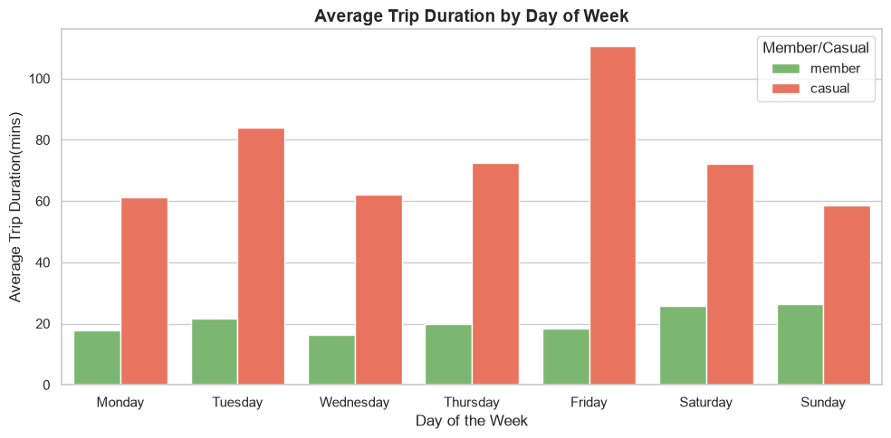
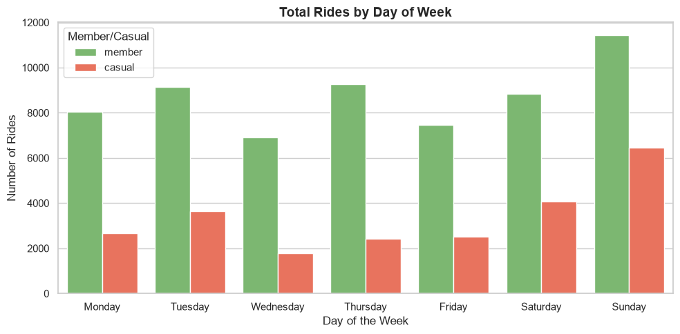
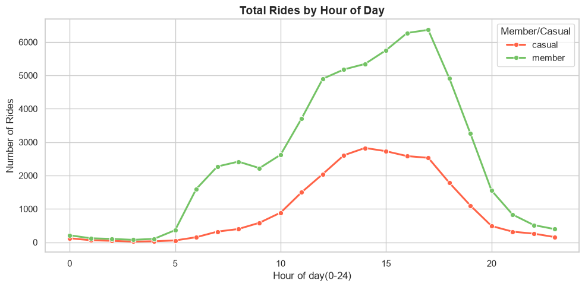

# Cyclistic Bike-Share Analysis
### Converting Casual Riders into Annual Members

A data analysis project exploring how Cyclistic bike-share usage differs between casual riders and annual members. The analysis follows the **Google Data Analytics framework**: Ask, Prepare, Process, Analyze, Share, and Act.

---

## Project Overview

Cyclistic’s finance team has found that annual members are more profitable than casual riders. This project analyzes April 2020 trip data to identify differences in rider behavior and recommend ways to encourage casual riders to become annual members.

**Dataset:** `202004-divvy-tripdata.csv`  
**Analysis tools:** Python, Pandas  
**Records analyzed:** 84,677 rides after cleaning

---

## Table of Contents

- [Ask](#1-ask)
- [Prepare](#2-prepare)
- [Process](#3-process)
- [Analyze](#4-analyze)
- [Share](#5-share)
- [Act](#6-act)

---

## 1. Ask

### Business task

Compare how casual riders and annual members use Cyclistic bikes, then use the findings to recommend marketing strategies that could increase annual memberships.

### Stakeholders

- **Lily Moreno, Director of Marketing:** Leads marketing campaigns and initiatives.
- **Cyclistic Executive Team:** Reviews and approves the proposed strategy.
- **Cyclistic Marketing Analytics Team:** Analyzes trip data and reports insights.

### Key questions

1. How do annual members and casual riders use Cyclistic bikes differently?
2. When are casual riders most active?
3. What marketing strategies could encourage casual riders to become members?

---

## 2. Prepare

### Data source

The analysis uses Cyclistic’s historical trip data, provided by Motivate International Inc. under an open license. The file `202004-divvy-tripdata.csv` contains **84,776 ride records from April 2020**.

### Key fields

- `ride_id`, `rideable_type`: Ride identifiers and bike type
- `started_at`, `ended_at`: Trip start and end timestamps
- `start_station_name`, `start_station_id`: Starting station details
- `end_station_name`, `end_station_id`: Ending station details
- `start_lat`, `start_lng`, `end_lat`, `end_lng`: Station coordinates
- `member_casual`: Rider category

### Data limitation

The analysis covers one month of data from April 2020. Results may not represent usage patterns in other months, seasons, or years.

---

## 3. Process

Data cleaning and feature engineering were completed in Python using Pandas.

- **Missing values:** Removed 99 records with missing values, leaving 84,677 records for analysis.
- **Timestamp conversion:** Converted `started_at` and `ended_at` to datetime format.
- **Feature engineering:** Created trip duration, day of the week, and trip start hour fields.

```python
import pandas as pd

# Load the raw trip data
df = pd.read_csv("202004-divvy-tripdata.csv")

# Remove rows with missing values
df_clean = df.dropna().copy()

# Convert timestamps to datetime
df_clean["started_at"] = pd.to_datetime(df_clean["started_at"])
df_clean["ended_at"] = pd.to_datetime(df_clean["ended_at"])

# Calculate trip duration in minutes
df_clean["trip_duration"] = (
    df_clean["ended_at"] - df_clean["started_at"]
).dt.total_seconds() / 60

# Extract the hour each ride began
df_clean["start_hour"] = df_clean["started_at"].dt.hour

# Set weekday order for analysis and visualization
days = [
    "Monday", "Tuesday", "Wednesday", "Thursday",
    "Friday", "Saturday", "Sunday"
]

df_clean["trip_day"] = pd.Categorical(
    df_clean["started_at"].dt.day_name(),
    categories=days,
    ordered=True
)
```

---

## 4. Analyze

### Rider activity

Annual members made up the larger share of trips and rode consistently throughout the workweek. Casual ridership increased on weekends.

### Trip duration

Casual riders took longer trips on average—approximately **40–50 minutes or more**—compared with member trips, which averaged about **12–15 minutes**.

### Daily and hourly patterns

- Member rides peaked around **8:00 a.m.** and **5:00–6:00 p.m.** on weekdays.
- Casual rides were concentrated in the afternoon, particularly between **12:00 p.m. and 4:00 p.m.** on weekends.
- Member ride volume remained relatively steady during the workweek, while casual rides increased toward Saturday and Sunday.

---

## 5. Share

### Average Trip Duration by Day of the Week



*Casual riders had longer average trips than members throughout the week, with the longest average durations occurring on weekends.*

### Total Rides by Day of the Week



*Member ride volume remained relatively steady on weekdays. Casual ridership increased toward the weekend and peaked on Saturday and Sunday.*

### Total Rides by Hour of the Day



*Member rides showed weekday morning and evening peaks. Casual rides increased through the day and were highest in the afternoon.*

---

## 6. Act

### Recommendations

1. **Target weekend riders:** Use in-app messages, digital ads, and station posters to promote annual memberships at popular weekend stations and recreational routes.
2. **Highlight membership value:** Show casual riders how membership costs compare with the cost of frequent or longer rides.
3. **Test flexible options:** Explore a weekend-focused pass or flexible membership for riders who use Cyclistic regularly but do not need daily access.
4. **Make upgrading easier:** Test a feature that lets riders apply the cost of a single-day pass toward an annual membership if they upgrade within 30 days.
5. **Reward repeat use:** Consider rewarding weekend rides or distance traveled with points redeemable for membership discounts or renewal benefits.

---

*This analysis is based on April 2020 trip data and may not reflect usage patterns in other months or years.*
